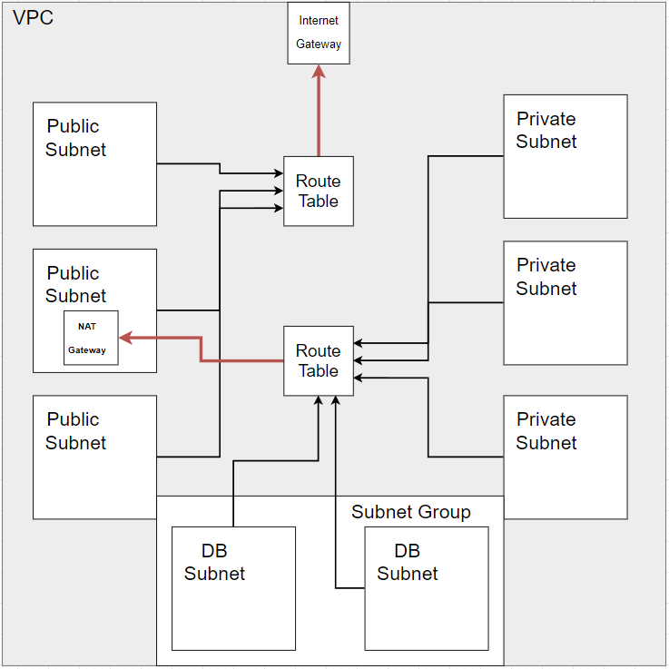
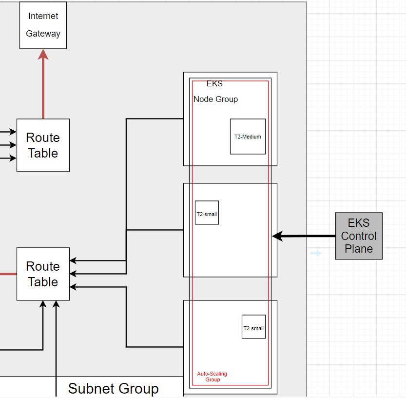
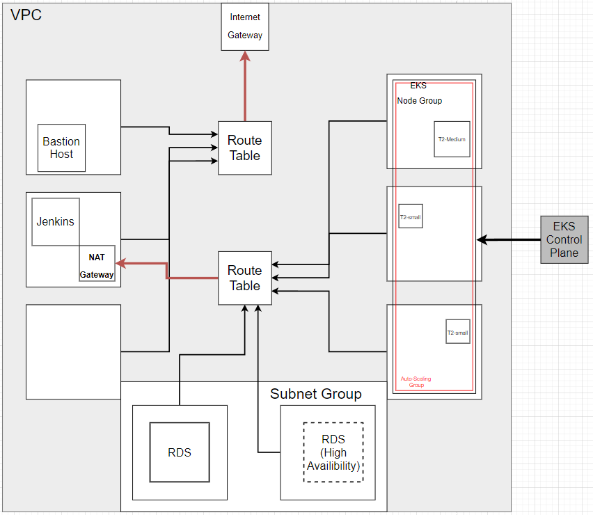

# DnD_Character_Gen

Full deployment making use of `terraform`, `ansible`, `docker` and, `kubernetes`.

## Using the Deployment

### Terraform

First, terraform needs to initilise the eks cluster.
It takes in three inputs as environment variables:

- access_key: **String**
- secret_key: **String**
- db_password: **String**
- key_name: **String**

Three pulled from system environment variables named;

- TF_VAR_access_key
- TF_VAR_secret_key
- TF_VAR_db_password

The `key_name` variable is set by default to `terraforminit`, you can change this in the variables file.

You can run all required commands once setting up the environment variables by running:

```bash
cd infrastructure/
./.deploy.sh
```

Terraform will create:

1 `VPC` containing:

- 3 Public `Subnets` across 3 AV
- 5 Private `Subnets` across 3 AV
  - 3 For the EKS Node Groups
  - 2 For the Database
- 1 `Internet Gateway`
- 1 `NAT Gateway`
- All required `Route-Tables`
- 1 `Subnet Group`

1 `EKS Cluster` making use of the previously created `VPC` containing:

- 2 `Auto-Scaling` Worker `Node Groups`
  - First starts at 2 `Node` capacity of t2.small
  - Second starts at 1 `Node` capacity of t2.medium
    - Both are configured to scale out or in as required.

2 `EC2` Instances

- First preconfigured to install `ansible`
- Second preconfigured to be used as a `jenkins` CI/CD server

1 `RDS` Instance

- Configured to launch into the `VPC`'s `subnet group`

Then, `terraform` will generate some needed files and attempt to push the changes to github.

### Manual Config

Second, you'll have to SSH onto the `jenkins` instance and configure the `aws cli` for the jenkins user:

```bash
sudo useradd -m jenkins
sudo su jenkins
aws configure
```

Next, set up `kubectl` to use the `terraform` generated cluster:

```bash
aws eks --region eu-west-2 update-kubeconfig --name dnd-eks
# See outputs for cluster name
```

Add some environment variables:

```bash
sudo su
echo 'export MYSQL_PWD=<YOUR_PASSWORD>'>>~/.bashrc
echo 'MYSQL_PWD=<YOUR_PASSWORD>'>>~/.profile
echo 'MYSQL_PWD=<YOUR_PASSWORD>'>>/etc/environment
echo 'export MYSQL_IP=<NAT_GATEWAY_IP>'>>~/.bashrc
echo 'MYSQL_IP=<NAT_GATEWAY_IP>'>>~/.profile
echo 'MYSQL_IP=<NAT_GATEWAY_IP>'>>/etc/environment
source ~/.bashrc
source ~/.profile
```

Finally, deploy the secret pod:

```bash
git clone <YOUR_REPO>.git
perl -pe "s/{MYSQL_PWD}/$MYSQL_PWD/g" <PATH_TO_YOUR_REPO>/kubernetes/secret.yaml | perl -pe "s/{MYSQL_IP}/$MYSQL_IP/g" - | kubectl apply -f -
```

### Ansible

Back to technology assisted configuration;
SSH onto the `bastion` instance and clone down the updated version of the repo.

```bash
git clone <YOUR-FORK>.git
```

Provide your bastion with the ssh key that can access jenkins. Don't forget to

```bash
chmod 600 key.pem
```

`Terraform` should of generated an `inventory` file for you and automatically pushed it up.
Running the `ansible playbook` should be as easy as:

```bash
cd ./infrastructure/ansible
ansible-playbook -i inventory Playbook.yaml
```

`Ansible` will install `Docker`, `Jenkins`, configure an `artifact repository` and, launch the initial version of the app.

### Kubernetes

The app is 4 services managed by a `kubernetes` deployment, behind an `NGINX` load balancer.
The `Jenkinsfile` has been generated by `terraform` to work out of the box.
Simply set up a new `Job` to pull from the repository and look for a `Jenkinsfile` as the pipeline.

Whenever the `Job` triggers, `jenkins` will build new versions of the images, push them to the `artifact repository` (held on the `jenkins` instance) and then, perform a rolling update on the deployment.

```text
I know people are going to ask, the 
docker-compose is so each image doesn't 
have to be built seperately by ansible
```

## Documentation

This deployment makes use of two very well documented modules provided by Hasicorp. Much more in depth documentation can be found by clicking on either [VPC Module](https://registry.terraform.io/modules/terraform-aws-modules/vpc/aws/latest) or [EKS Module](https://registry.terraform.io/modules/terraform-aws-modules/eks/aws/latest).

### VPC

This use of the VPC Module Creates a `High-Availibility` capable network.



### EKS

The use of the EKS module is a bit more complex.
For more information on everything eks actually does for us, I'd recomment the AWS documentation website itself, or delving into the GUI of aws and reading what all the options will do for you.
The terraform documentation is very good but not at a beginner level like the rest of the documentation. a certain amount of understanding is required beforehand.



### EC2

The only hand made module used was the EC2 module:

The EC2 module is configured to create two EC2 instances in a public subnet.
Then, it creates an RDS instance using SQL with the required initial database name.

### Inputs

- instance_type: **String**
- ami_id: **String**
- security_group: **Security Group ID**
- public_net_id: **Public Subnet ID**
- key_name: **String**
- av_zone: **String**
- db_password: **String**
- sec_group_ids: **IDs of Security groups for database**
- subnet_group_name: **Subnet Group Name**
- public_net_id: **ID of public subnet to launch instance to**
- nat_ip: **NAT Gateway IP address**

### Outputs

- bastion_ip: **Public IP of bastion host instance on launch**
- jenk_ip: **Public IP of jenkins instance on launch**

With this module our infrastructure looks like this:



### CI/CD

The `Jenkinsfile` is pretty much the same few commands repeated.
So, lets take one stage:

```bash
stage('--Front End--'){
     steps{
       sh '''
               image="<JENKINS-IP-WOULD-BE-HERE>:5000/frontend:build-$BUILD_NUMBER"
               docker build -t $image /var/lib/jenkins/workspace/$JOB_BASE_NAME/frontend
               docker push $image
               kubectl set image deployment/frontend frontend=$image
       '''
     }
  }
```

Firstly, jenkins sets a variable called `image`, it creates the value based on this pattern:

```text
<Name_Of_Repository>/<Image_Name>:<Version_Tag>
```

You'll notice the version tag is being set using a jenkins variable called `BUILD_NUMBER` this variable will change based on the amount of times jenkins has run.

You'll also notice, jenkins is using it's own IP address and port number as the location for the image, this is because ansible has created a docker repository on port 5000.

Next, jenkins builds a new image based on the fresh version of the repo it has automatically cloned.
Naming the image the way outlined above.

Then, docker pushes the image to it's own repo. (It goes to it's own repo because of how the image was named)

Finally, the stage interacts with the EKS control plane to update the image of the appropriate service, pulling the image from the repo, saving us the hassle of transferring images off the jenkins instance.
